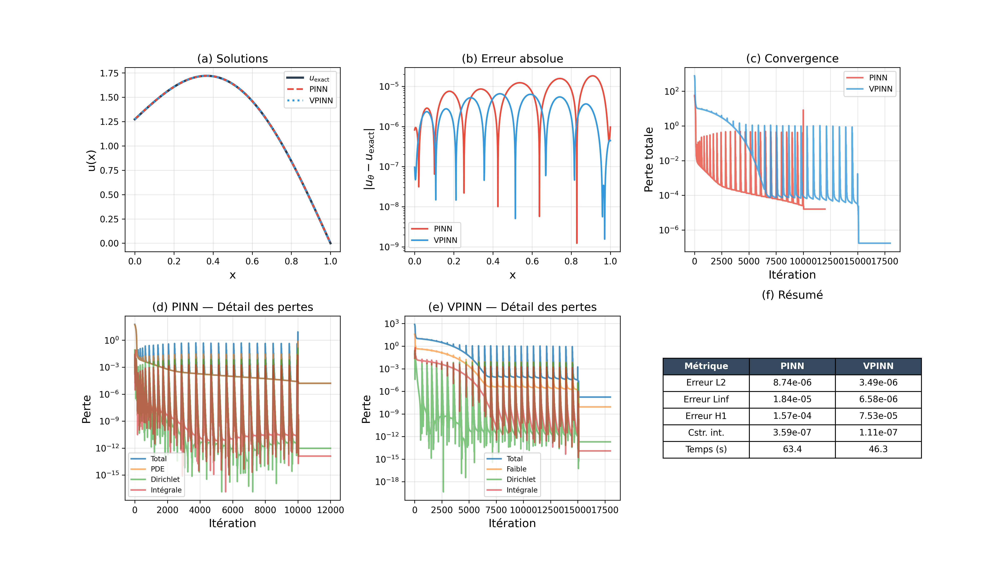
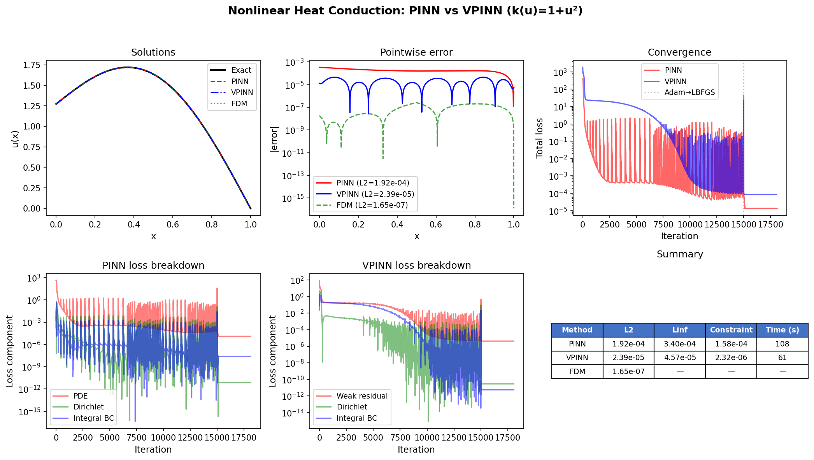
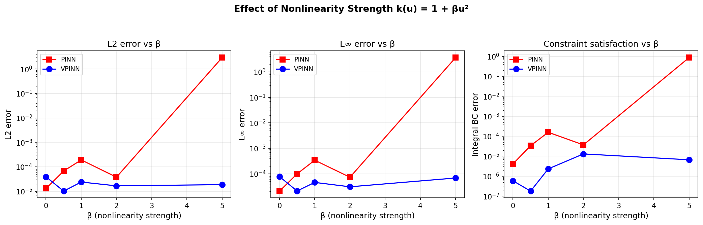
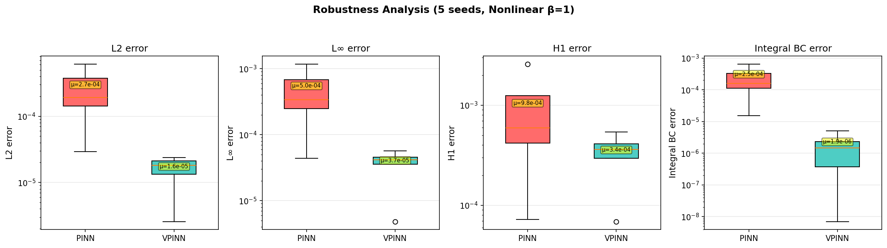

# PINN vs VPINN for 1D Steady-State Heat Conduction with Nonlocal Integral Boundary Condition

> A comparative study of Physics-Informed Neural Networks (PINN) and Variational Physics-Informed Neural Networks (VPINN) applied to elliptic PDEs with a nonlocal integral boundary condition — covering both the **linear** and **nonlinear** (temperature-dependent conductivity) regimes.

---

## Problem Statement

We consider steady-state heat conduction on a unit bar with two formulations:

### Linear Case

$$-u''(x) = f(x), \quad x \in (0, 1)$$

### Nonlinear Case (temperature-dependent conductivity)

$$-\bigl[k(u)\, u'(x)\bigr]' = f(x), \quad x \in (0, 1), \qquad k(u) = 1 + \beta\, u^2$$

Both cases share the same **nonlocal integral boundary condition** at the left end and a Dirichlet condition at the right end:

$$u(0) = \alpha \int_0^1 u(x)\, dx + g_0 \qquad \text{(integral BC)}$$

$$u(1) = g_1 \qquad \text{(Dirichlet BC)}$$

This class of nonlocal conditions arises in models involving energy specification constraints, distributed sensors, and thermoelastic feedback systems.

### Manufactured Solution

For validation, the same analytical solution is used in both cases:

$$u(x) = \sin(\pi x) + (1 - x) \cdot \frac{4}{\pi}$$

with $\alpha = 1$, $g_0 = 0$, $g_1 = 0$. The source term $f(x)$ is computed by substitution into the governing equation, ensuring exact satisfaction.

---

## Methods

### PINN — Strong Formulation

The PDE residual is enforced **point-wise** at interior collocation points. For the nonlinear case, the residual is computed via automatic differentiation on the flux $\varphi = k(u_\theta)\, u'_\theta$:

$$r_f(x_i) = -\varphi'(x_i) - f(x_i)$$

This avoids manually expanding the chain rule and only requires first-order AD applied twice.

### VPINN — Weak (Variational) Formulation

The weak form is obtained by integration by parts against Legendre test functions $\{v_k\}$ satisfying $v_k(1) = 0$:

$$R_k = \int_0^1 k(u_\theta)\, u'_\theta\, v'_k\, dx \;-\; \lambda\, v_k(0) \;-\; \int_0^1 f\, v_k\, dx$$

where $\lambda$ is a trainable Lagrange multiplier representing the boundary flux. Key advantages:
- Reduces the required differentiation order from 2 to 1
- Naturally accommodates the global integral constraint
- Demonstrates superior robustness for strongly nonlinear problems

---

## Results

### Linear Case ($\beta = 0$)

| Metric | PINN | VPINN |
|---|---|---|
| L2 error | 8.74 × 10⁻⁶ | **3.49 × 10⁻⁶** |
| L∞ error | 1.84 × 10⁻⁵ | **6.58 × 10⁻⁶** |
| H1 error | 1.57 × 10⁻⁴ | **7.53 × 10⁻⁵** |

<p align="center">
  
</p>

### Nonlinear Case ($\beta = 1$, $k(u) = 1 + u^2$)

| Metric | PINN | VPINN |
|---|---|---|
| L2 error | 1.92 × 10⁻⁴ | **2.39 × 10⁻⁵** |
| L∞ error | 3.40 × 10⁻⁴ | **4.57 × 10⁻⁵** |
| Integral BC | 1.58 × 10⁻⁴ | **2.32 × 10⁻⁶** |
| Time (s) | 108 | **61** |

<p align="center">
  
</p>

### Effect of Nonlinearity Strength

The VPINN maintains accuracy across all tested values of $\beta$, while the PINN **diverges completely** at $\beta = 5$:

| $\beta$ | PINN L2 | VPINN L2 |
|---|---|---|
| 0 | 1.30 × 10⁻⁵ | 3.92 × 10⁻⁵ |
| 0.5 | 6.73 × 10⁻⁵ | **1.02 × 10⁻⁵** |
| 1.0 | 1.92 × 10⁻⁴ | **2.39 × 10⁻⁵** |
| 2.0 | 3.79 × 10⁻⁵ | **1.67 × 10⁻⁵** |
| 5.0 | **2.95 (FAIL)** | **1.87 × 10⁻⁵** |

<p align="center">
  
</p>

### Robustness (Nonlinear, 5 seeds)

| Method | Mean L2 | Std L2 |
|---|---|---|
| PINN | 2.70 × 10⁻⁴ | 2.05 × 10⁻⁴ |
| VPINN | **1.58 × 10⁻⁵** | **7.52 × 10⁻⁶** |

<p align="center">
  
</p>

---

## Repository Structure

```
.
├── README.md
├── LICENSE
├── linear/                          # Linear case (-u'' = f)
│   ├── requirements.txt
│   ├── src/
│   │   ├── exact_solution.py        # Manufactured solution
│   │   ├── network.py               # MLP architecture
│   │   ├── utils.py                 # Quadrature, test functions, FDM, metrics
│   │   ├── pinn_solver.py           # PINN (strong form)
│   │   ├── vpinn_solver.py          # VPINN (weak form)
│   │   └── run_all.py               # Master script: 4 studies + 5 figures
│   └── figures/
├── nonlinear/                       # Nonlinear case (-[k(u)u']' = f)
│   ├── requirements.txt
│   ├── src/
│   │   ├── exact_solution.py        # Nonlinear manufactured solution
│   │   ├── network.py               # MLP architecture
│   │   ├── utils.py                 # + Newton-Raphson FDM solver
│   │   ├── pinn_solver.py           # PINN with flux-based AD
│   │   ├── vpinn_solver.py          # VPINN with k(u) in weak form
│   │   └── run_all.py               # Master script: 5 studies + 5 figures
│   └── figures/
```

## Quick Start

### Requirements

- Python >= 3.10
- PyTorch >= 2.0
- NumPy >= 1.24
- Matplotlib >= 3.7

```bash
pip install torch numpy matplotlib
```

### Run Linear Benchmark

```bash
cd linear/src/
python run_all.py
```

### Run Nonlinear Benchmark

```bash
cd nonlinear/src/
python run_all.py
```

### Custom Configuration

Both solvers accept a configuration dictionary:

```python
from pinn_solver import train_pinn

results = train_pinn(config={
    "n_hidden": 64,
    "n_layers": 5,
    "beta": 2.0,       # nonlinearity strength (nonlinear case only)
    "n_adam": 20_000,
    "seed": 123,
})

print(f"L2 error: {results['errors']['L2']:.4e}")
```

---

## Key References

1. **Raissi, M., Perdikaris, P. & Karniadakis, G.E.** (2019). Physics-informed neural networks: A deep learning framework for solving forward and inverse problems involving nonlinear partial differential equations. *J. Comput. Phys.*, 378, 686-707.

2. **Kharazmi, E., Zhang, Z. & Karniadakis, G.E.** (2021). hp-VPINNs: Variational physics-informed neural networks with domain decomposition. *CMAME*, 374, 113547.

3. **Liu, Y.** (1999). Numerical solution of the heat equation with nonlocal boundary conditions. *J. Comput. Appl. Math.*, 110(1), 115-127.

4. **Cannon, J.R.** (1963). The solution of the heat equation subject to the specification of energy. *Quart. Appl. Math.*, 21(2), 155-160.

---

## Citation

If you use this code in your research or projects, please cite:

```bibtex
@software{auger2026pinn_integral_bc,
  author       = {Auger, Maxime},
  title        = {{PINN vs VPINN for 1D Heat Conduction with Nonlocal
                   Integral Boundary Condition}},
  year         = {2026},
  url          = {https://github.com/MaximeAuger/steady-state-heat-conduction},
  institution  = {FEMTO-ST Institute, Dept. of Applied Mechanics, ENSMM}
}
```

## License

This project is licensed under the **MIT License** — see [LICENSE](LICENSE) for details.

---

**Author:** Maxime Auger — [FEMTO-ST Institute](https://www.femto-st.fr/), Dept. of Applied Mechanics, ENSMM, Besancon, France.
