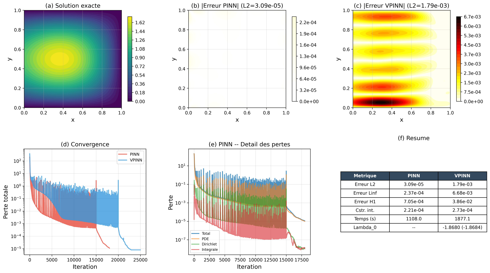
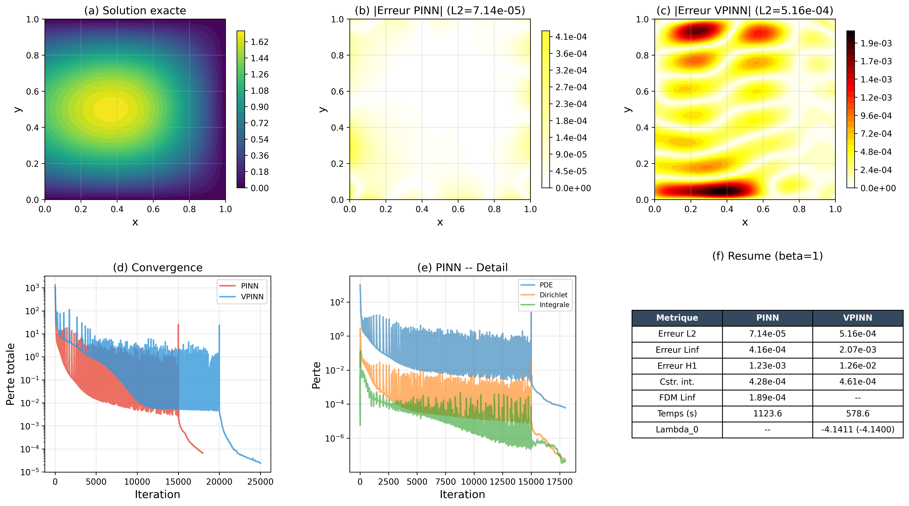
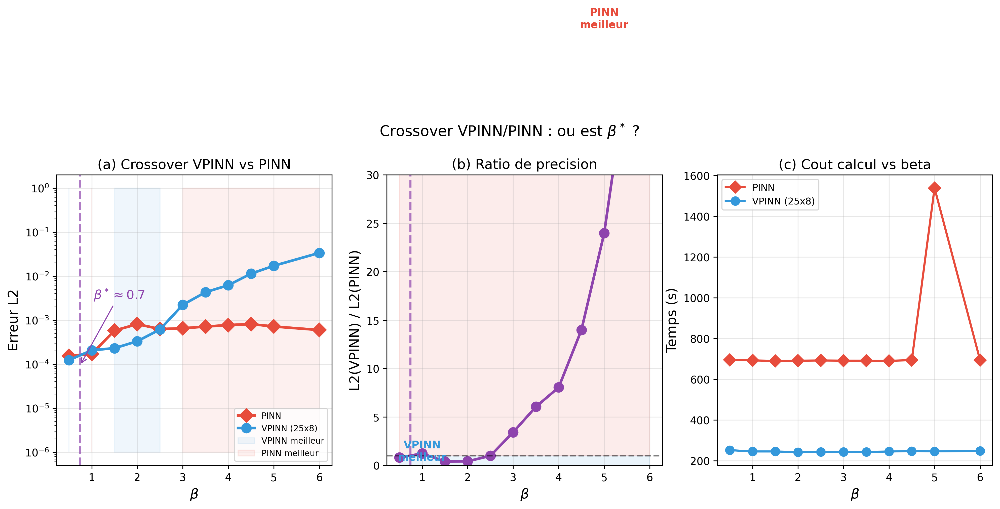
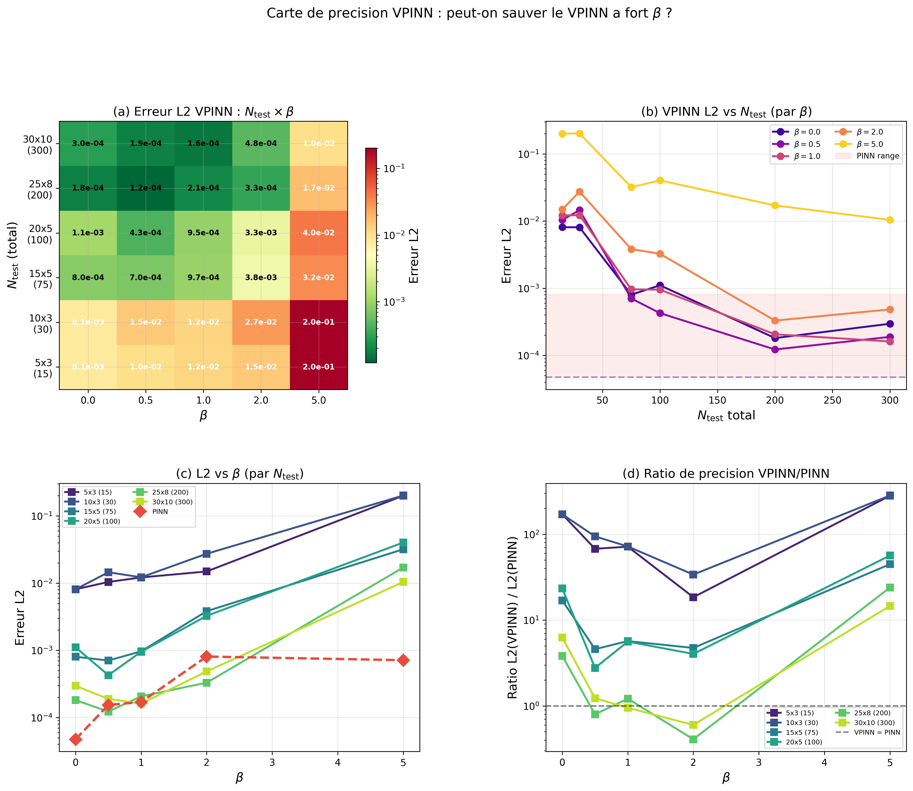

# PINN vs VPINN for Steady-State Heat Conduction with Nonlocal Integral Boundary Condition

> A comparative study of Physics-Informed Neural Networks (PINN) and Variational Physics-Informed Neural Networks (VPINN) applied to elliptic PDEs with a nonlocal integral boundary condition — in **1D and 2D**, covering both **linear** and **nonlinear** (temperature-dependent conductivity) regimes.

---

## Problem Statement

We consider steady-state heat conduction with two formulations, in 1D and 2D:

### 1D Formulation

**Linear:**
$$-u''(x) = f(x), \quad x \in (0, 1)$$

**Nonlinear** (temperature-dependent conductivity):
$$-\bigl[k(u)\, u'(x)\bigr]' = f(x), \quad x \in (0, 1), \qquad k(u) = 1 + \beta\, u^2$$

### 2D Formulation

**Linear (Poisson):**
$$-\Delta u = f(x,y), \quad (x,y) \in (0, 1)^2$$

**Nonlinear:**
$$-\nabla \cdot \bigl[k(u)\, \nabla u\bigr] = f(x,y), \quad (x,y) \in (0, 1)^2, \qquad k(u) = 1 + \beta\, u^2$$

### Boundary Conditions

All cases share a **nonlocal integral boundary condition** on the left edge and Dirichlet conditions elsewhere:

| Boundary | 1D | 2D |
|---|---|---|
| Left | $u(0) = \alpha \int_0^1 u(x)\,dx + g_0$ | $u(0,y) = \alpha \int_0^1 u(x,y)\,dx$ for each $y$ |
| Right | $u(1) = g_1$ | $u(1,y) = 0$ |
| Bottom / Top | — | $u(x,0) = u(x,1) = 0$ |

This class of nonlocal conditions arises in models involving energy specification constraints, distributed sensors, and thermoelastic feedback systems.

### Manufactured Solutions

**1D:** $u(x) = \sin(\pi x) + (1 - x) \cdot \frac{4}{\pi}$

**2D:** $u(x,y) = \sin(\pi y) \cdot \bigl[\sin(\pi x) + (1 - x) \cdot \frac{4}{\pi}\bigr]$

The 2D solution is a separable extension of the 1D case. The source term $f$ is computed by substitution into the governing equation.

---

## Methods

### PINN — Strong Formulation

The PDE residual is enforced **point-wise** at interior collocation points. For nonlinear cases, the residual is computed via automatic differentiation on the flux $\boldsymbol{\varphi} = k(u_\theta)\, \nabla u_\theta$:

$$r_f(\mathbf{x}_i) = -\nabla \cdot \boldsymbol{\varphi}(\mathbf{x}_i) - f(\mathbf{x}_i)$$

This flux-based AD approach avoids manually expanding the chain rule.

### VPINN — Weak (Variational) Formulation

The weak form is obtained by integration by parts against test functions:

- **1D:** Legendre test functions $v_k(x) = P_k(2x-1) - 1$ with $v_k(1) = 0$
- **2D:** Tensor product $v_i(x) \cdot w_j(y)$ where $v_i$ are Legendre and $w_j(y) = \sin(j\pi y)$

The boundary flux appears naturally as a trainable **Lagrange multiplier** — scalar $\lambda$ in 1D, vector $\boldsymbol{\lambda}$ (Fourier-sine coefficients) in 2D. Key advantages:
- Reduces the required differentiation order from 2 to 1
- Naturally accommodates the global integral constraint
- Provides the boundary flux as a free output

---

## Results

### 1D — Linear Case

| Metric | PINN | VPINN |
|---|---|---|
| L2 error | 8.74 × 10⁻⁶ | **3.49 × 10⁻⁶** |
| L∞ error | 1.84 × 10⁻⁵ | **6.58 × 10⁻⁶** |
| H1 error | 1.57 × 10⁻⁴ | **7.53 × 10⁻⁵** |

<p align="center">
  
</p>

### 1D — Nonlinear Case ($\beta = 1$)

| Metric | PINN | VPINN |
|---|---|---|
| L2 error | 1.92 × 10⁻⁴ | **2.39 × 10⁻⁵** |
| L∞ error | 3.40 × 10⁻⁴ | **4.57 × 10⁻⁵** |
| Integral BC | 1.58 × 10⁻⁴ | **2.32 × 10⁻⁶** |

<p align="center">
  
</p>

### 2D — Linear Case (Poisson)

| Metric | PINN | VPINN |
|---|---|---|
| L2 error | **3.09 × 10⁻⁵** | 1.79 × 10⁻³ |
| Time (min) | **18** | 31 |
| $\lambda_0$ | — | −1.8680 (exact: −1.8684) |

VPINN improves to L2 = 1.92 × 10⁻⁴ with enriched test space ($N_{\text{test}} = 25 \times 8$).

<p align="center">
  
</p>

### 2D — Nonlinear Case ($\beta = 1$)

| Metric | PINN | VPINN |
|---|---|---|
| L2 error | **7.14 × 10⁻⁵** | 5.16 × 10⁻⁴ |
| $\lambda_0$ | — | −4.1411 (exact: −4.1400) |

<p align="center">
  
</p>

### Key Finding: Crossover Between VPINN and PINN in 2D

In 2D with sufficient test functions ($25 \times 8$), the VPINN **surpasses** the PINN for moderate nonlinearity ($\beta \leq 2.5$), but the PINN dominates at strong nonlinearity ($\beta \geq 3$). The crossover occurs around $\beta^* \approx 2.7$:

| $\beta$ | PINN L2 | VPINN L2 (25×8) | Winner |
|---|---|---|---|
| 0.5 | 1.54 × 10⁻⁴ | **1.23 × 10⁻⁴** | VPINN |
| 2.0 | 8.08 × 10⁻⁴ | **3.30 × 10⁻⁴** | VPINN ×2.4 |
| 3.0 | **6.50 × 10⁻⁴** | 2.22 × 10⁻³ | PINN ×3.4 |
| 5.0 | **7.13 × 10⁻⁴** | 1.71 × 10⁻² | PINN ×24 |

<p align="center">
  
</p>

<p align="center">
  
</p>

### 1D vs 2D Summary

| Dimension | Regime | PINN L2 | VPINN L2 | Best default |
|---|---|---|---|---|
| 1D | Linear | 8.74 × 10⁻⁶ | **3.49 × 10⁻⁶** | VPINN |
| 1D | NL $\beta=1$ | 1.92 × 10⁻⁴ | **2.39 × 10⁻⁵** | VPINN |
| 2D | Linear | **3.09 × 10⁻⁵** | 1.79 × 10⁻³ | PINN |
| 2D | NL $\beta=1$ | **7.14 × 10⁻⁵** | 5.16 × 10⁻⁴ | PINN |

> In 1D the VPINN dominates. In 2D the PINN leads with default settings, but the VPINN catches up with enriched test spaces and surpasses PINN for moderate nonlinearity.

---

## Repository Structure

```
.
├── README.md
├── LICENSE
├── linear/                          # 1D linear (-u'' = f)
│   ├── requirements.txt
│   ├── src/
│   │   ├── exact_solution.py
│   │   ├── network.py
│   │   ├── utils.py
│   │   ├── pinn_solver.py
│   │   ├── vpinn_solver.py
│   │   └── run_all.py               # 4 studies + 5 figures
│   └── figures/
├── nonlinear/                       # 1D nonlinear (-[k(u)u']' = f)
│   ├── requirements.txt
│   ├── src/
│   │   ├── exact_solution.py
│   │   ├── network.py
│   │   ├── utils.py
│   │   ├── pinn_solver.py
│   │   ├── vpinn_solver.py
│   │   └── run_all.py               # 5 studies + 5 figures
│   └── figures/
├── 2D_linear/                       # 2D Poisson (-Δu = f)
│   ├── requirements.txt
│   ├── src/
│   │   ├── exact_solution.py
│   │   ├── network.py
│   │   ├── utils.py
│   │   ├── pinn_solver.py
│   │   ├── vpinn_solver.py
│   │   └── run_all.py               # 4 studies + 5 figures
│   └── results/                     # Figures + summary
├── 2D_nonlinear/                    # 2D nonlinear (-div(k∇u) = f)
│   ├── requirements.txt
│   ├── src/
│   │   ├── exact_solution.py
│   │   ├── network.py
│   │   ├── utils.py
│   │   ├── pinn_solver.py
│   │   ├── vpinn_solver.py
│   │   ├── run_all.py               # 5 studies + 5 figures
│   │   ├── study_ntest_beta_heatmap.py   # N_test × β analysis
│   │   └── study_deep_analysis.py        # Crossover + push N_test
│   └── results/                     # 10 figures + summaries
```

## Quick Start

### Requirements

- Python >= 3.10
- PyTorch >= 2.0
- NumPy >= 1.24
- SciPy >= 1.10 (for 2D FDM sparse solvers)
- Matplotlib >= 3.7

```bash
pip install torch numpy scipy matplotlib
```

### Run All Benchmarks

```bash
# 1D linear (~30 min)
cd linear/src && python run_all.py

# 1D nonlinear (~1h)
cd nonlinear/src && python run_all.py

# 2D linear (~2.5h, CPU)
cd 2D_linear/src && python run_all.py

# 2D nonlinear (~4.5h, CPU)
cd 2D_nonlinear/src && python run_all.py

# Deep analysis: crossover + N_test push (~3h)
cd 2D_nonlinear/src && python study_ntest_beta_heatmap.py
cd 2D_nonlinear/src && python study_deep_analysis.py
```

### Custom Configuration

All solvers accept a configuration dictionary :

```python
from pinn_solver import train_pinn

results = train_pinn(config={
    "n_hidden": 64,
    "n_layers": 5,
    "beta": 2.0,       # nonlinearity strength (nonlinear cases)
    "n_adam": 20_000,
    "seed": 123,
})

print(f"L2 error: {results['errors']['L2']:.4e}")
```

---

## Key References

1. **Raissi, M., Perdikaris, P. & Karniadakis, G.E.** (2019). Physics-informed neural networks: A deep learning framework for solving forward and inverse problems involving nonlinear partial differential equations. *J. Comput. Phys.*, 378, 686-707.

2. **Kharazmi, E., Zhang, Z. & Karniadakis, G.E.** (2021). hp-VPINNs: Variational physics-informed neural networks with domain decomposition. *CMAME*, 374, 113547.

3. **Liu, Y.** (1999). Numerical solution of the heat equation with nonlocal boundary conditions. *J. Comput. Appl. Math.*, 110(1), 115-127.

4. **Cannon, J.R.** (1963). The solution of the heat equation subject to the specification of energy. *Quart. Appl. Math.*, 21(2), 155-160.

---

## Citation

If you use this code in your research or projects, please cite:

```bibtex
@software{auger2026pinn_integral_bc,
  author       = {Auger, Maxime},
  title        = {{PINN vs VPINN for Steady-State Heat Conduction with
                   Nonlocal Integral Boundary Condition (1D and 2D)}},
  year         = {2026},
  url          = {https://github.com/MaximeAuger/steady-state-heat-conduction},
  institution  = {FEMTO-ST Institute, Dept. of Applied Mechanics, SUPMICROTECH}
}
```

## License

This project is licensed under the **MIT License** — see [LICENSE](LICENSE) for details.

---

**Author:** Maxime Auger — [FEMTO-ST Institute](https://www.femto-st.fr/), Dept. of Applied Mechanics, ENSMM, Besancon, France.
