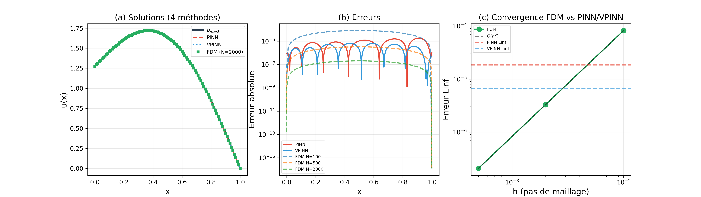
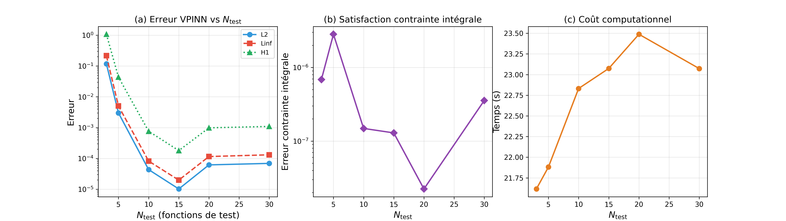
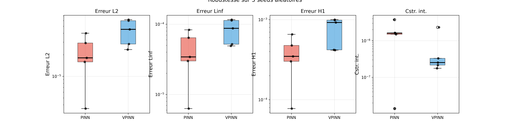

# PINN vs VPINN for 1D Steady-State Heat Conduction with Nonlocal Integral Boundary Condition

> A comparative study of Physics-Informed Neural Networks (PINN) and Variational Physics-Informed Neural Networks (VPINN) applied to a canonical elliptic PDE with a nonlocal integral boundary condition — a class of problems that, to the best of our knowledge, has not been explicitly addressed in the PINN/VPINN literature.

---

## Problem Statement

We consider the one-dimensional steady-state heat equation on a unit bar:

$$-u''(x) = f(x), \quad x \in (0, 1)$$

subject to a **nonlocal integral boundary condition** at the left end and a classical Dirichlet condition at the right end:

$$u(0) = \alpha \int_0^1 u(x)\, dx + g_0 \qquad \text{(integral BC)}$$

$$u(1) = g_1 \qquad \text{(Dirichlet BC)}$$

This type of nonlocal condition arises in models involving energy specification constraints, distributed sensors, and global feedback control systems.

### Manufactured Solution

For validation purposes, we use the following analytical solution:

$$u(x) = \sin(\pi x) + (1 - x) \cdot \frac{4}{\pi}$$

with parameters $\alpha = 1$, $g_0 = 0$, $g_1 = 0$, and source term $f(x) = \pi^2 \sin(\pi x)$.

---

## Methods

### PINN — Strong Formulation

The PDE residual is enforced **point-wise** at interior collocation points:

$$r_f(x_i) = -u''_\theta(x_i) - f(x_i)$$

where $u''_\theta$ is obtained via automatic differentiation.  The integral BC is approximated by Gauss–Legendre quadrature.  The total loss is:

$$\mathcal{L}_{\text{PINN}} = w_f \frac{1}{N_f} \sum_{i=1}^{N_f} r_f^2(x_i) + w_D \, r_D^2 + w_I \, r_I^2$$

### VPINN — Weak (Variational) Formulation

Starting from the weak form obtained by integration by parts, the solution is projected onto a set of test functions $\{v_k\}$ (shifted Legendre polynomials satisfying $v_k(1) = 0$):

$$R_k = \int_0^1 u'_\theta(x)\, v'_k(x)\, dx \;-\; \lambda\, v_k(0) \;-\; \int_0^1 f(x)\, v_k(x)\, dx$$

where $\lambda \approx u'(0)$ is a trainable Lagrange multiplier.  This formulation:
- Reduces the required differentiation order from 2 to 1
- Naturally accommodates the global integral constraint
- Allows vectorised evaluation through a single forward pass

---

## Results

### Main Comparison

| Metric | PINN (strong) | VPINN (weak) |
|---|---|---|
| L2 error | 8.74 × 10⁻⁶ | **3.49 × 10⁻⁶** |
| L∞ error | 1.84 × 10⁻⁵ | **6.58 × 10⁻⁶** |
| H1 error | 1.57 × 10⁻⁴ | **7.53 × 10⁻⁵** |
| Integral BC | 3.59 × 10⁻⁷ | **1.11 × 10⁻⁷** |
| Time (s) | 63.4 | **46.3** |

<p align="center">
  
</p>

### Independent Validation (Finite Differences)

A second-order centred finite difference scheme with trapezoidal-rule discretisation of the integral BC confirms the accuracy of both neural network methods.

<p align="center">
  
</p>

### VPINN Convergence vs Number of Test Functions

The accuracy of the VPINN depends on the richness of the test-function basis.  An optimal range of 10–15 Legendre polynomials is observed for this problem.

<p align="center">
  
</p>

### Robustness Analysis

Both methods are evaluated over 5 independent random seeds to assess sensitivity to network initialisation.

<p align="center">
  
</p>

---

## Repository Structure

```
.
├── README.md
├── LICENSE
├── requirements.txt
├── src/
│   ├── exact_solution.py     # Manufactured solution and verification
│   ├── network.py            # MLP architecture (tanh, Xavier init)
│   ├── utils.py              # Quadrature, test functions, FDM solver, metrics
│   ├── pinn_solver.py        # PINN training (strong formulation)
│   ├── vpinn_solver.py       # VPINN training (weak formulation)
│   └── run_all.py            # Master script: all studies + figures
└── figures/                  # Generated figures
```

## Quick Start

### Requirements

- Python ≥ 3.10
- PyTorch ≥ 2.0
- NumPy ≥ 1.24
- Matplotlib ≥ 3.7

```bash
pip install -r requirements.txt
```

### Run Everything

```bash
cd src/
python run_all.py
```

This runs the four studies (main comparison, FDM validation, N_test convergence, robustness), generates five publication-quality figures in `figures/`, and prints a summary to the terminal.  Total runtime is approximately 10 minutes on a standard laptop CPU.

### Run Individual Methods

```bash
cd src/
python pinn_solver.py      # PINN only
python vpinn_solver.py     # VPINN only
```

### Custom Configuration

Both solvers accept a configuration dictionary to override default hyper-parameters:

```python
from pinn_solver import train_pinn

results = train_pinn(config={
    "n_hidden": 64,
    "n_layers": 5,
    "n_adam": 20_000,
    "seed": 123,
})

print(f"L2 error: {results['errors']['L2']:.4e}")
```

---

## Key References

1. **Raissi, M., Perdikaris, P. & Karniadakis, G.E.** (2019). Physics-informed neural networks: A deep learning framework for solving forward and inverse problems involving nonlinear partial differential equations. *J. Comput. Phys.*, 378, 686–707.

2. **Kharazmi, E., Zhang, Z. & Karniadakis, G.E.** (2021). hp-VPINNs: Variational physics-informed neural networks with domain decomposition. *CMAME*, 374, 113547.

3. **Liu, Y.** (1999). Numerical solution of the heat equation with nonlocal boundary conditions. *J. Comput. Appl. Math.*, 110(1), 115–127.

4. **Cannon, J.R.** (1963). The solution of the heat equation subject to the specification of energy. *Quart. Appl. Math.*, 21(2), 155–160.

5. **D'Elia, M. et al.** (2022). Nonlocal physics-informed neural networks (nPINNs). *Commun. Appl. Math. Comput.*.

---

## Citation

If you use this code in your research or projects, please cite:

```bibtex
@software{auger2026pinn_integral_bc,
  author       = {Auger, Maxime},
  title        = {{PINN vs VPINN for 1D Heat Conduction with Nonlocal
                   Integral Boundary Condition}},
  year         = {2026},
  url          = {https://github.com/MaximeAuger/steady-state-heat-conduction},
  institution  = {FEMTO-ST Institute, Dept. of Applied Mechanics, ENSMM}
}
```

## License

This project is licensed under the **MIT License** — see [LICENSE](LICENSE) for details.

---

**Author:** Maxime Auger — [FEMTO-ST Institute](https://www.femto-st.fr/), Dept. of Applied Mechanics, ENSMM, Besancon, France.
